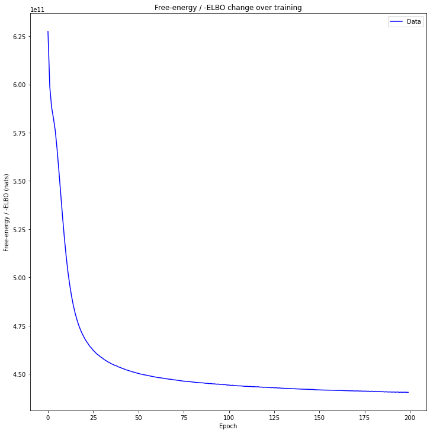

Model Training
==============

To train, load the tar db file and initilize a DTFA.DeepTFA container with the following lines:

.. code-block:: python

    import htfa_torch.dtfa as DTFA
    import htfa_torch.tardb as tardb
    tar_db = tardb.FmriTarDataset('to/your/database.tar')
    dtfa = DTFA.DeepTFA(tar_db, num_factors=100, embedding_dim=2)

This may take a while.

After the container is created, dtfa.train() may be called which automatically trains the model and saves the epochs in the current directory.

.. code-block:: python

    losses = dtfa.train(num_steps=200, 
        learning_rate={'q': 1e-2, 'p': 1e-4}, 
        log_level=logging.INFO, num_particles=1,
        batch_size=80, use_cuda=True, checkpoint_steps=100, patience=500,
        blocks_filter=tar_db.inference_filter(training=True))

ELBO losses can be seen with the following line: 

.. code-block:: python

    utils.plot_losses(losses)

Additional Notes
----------------

[TODO]